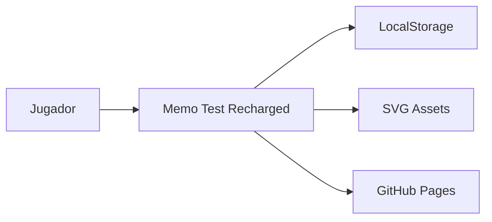
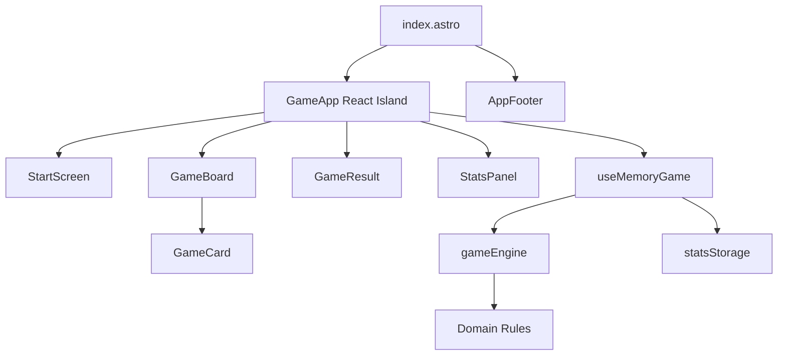

# Architecture

Memo Test Recharged usa una arquitectura frontend por feature con separacion explicita entre dominio, aplicacion y presentacion.

## Capas

```txt
UI -> Application -> Domain
```

- **UI**: React components, Motion animations, Tailwind classes.
- **Application**: hooks que coordinan estado de React, timers y persistencia local.
- **Domain**: reglas puras, entidades, factories y servicios sin dependencia de React/Astro.

## Reglas De Dependencia

- `domain` no importa `ui` ni React.
- `domain` no lee directamente del DOM.
- `application` puede usar `domain` y browser APIs.
- `ui` solo consume la facade de aplicacion.

## Patrones Aplicados

- **Factory**: `createGame` genera partidas validas desde opciones.
- **Strategy**: cada `Level` define dificultad, tiempo y multiplicador.
- **State Machine**: `idle`, `playing`, `checking`, `won`, `lost`.
- **Facade**: `useMemoryGame` expone acciones simples para la UI.
- **Repository/Adapter local**: `statsStorage` encapsula `localStorage`.
- **Pure Functions**: reglas testeables sin framework.

## C4 Context



## Component Map


