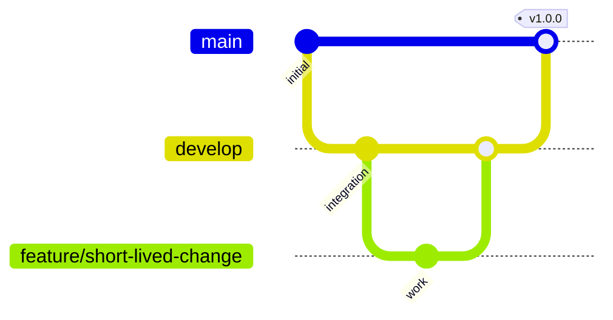

# Git Workflow

## Modelo De Ramas

## Ramas Principales

- `main`: rama estable, desplegable y protegida.
- `develop`: rama de integracion para features aprobadas.

## Ramas Temporales

- `feature/nombre-corto`
- `fix/nombre-corto`
- `chore/nombre-corto`
- `release/x.y.z`

## Reglas De Proteccion Recomendadas

Para `main`:

- Require pull request before merging.
- Require status checks to pass.
- Require branches to be up to date.
- Restrict force pushes.
- Restrict deletions.

Para `develop`:

- Require pull request before merging.
- Require CI passing.
- Allow squash merge.

## Estrategia De Release

1. `feature/*` entra a `develop` por PR.
2. Cuando `develop` esta estable, crear `release/x.y.z`.
3. Corregir bugs de release en `release/x.y.z`.
4. Merge a `main` y tag SemVer.
5. Merge de vuelta a `develop` si hubo fixes.
