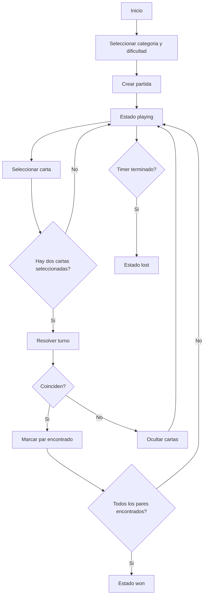

# Game Flow

```mermaid
flowchart TD
  A[Inicio] --> B[Seleccionar categoria y dificultad]
  B --> C[Crear partida]
  C --> D[Estado playing]
  D --> E[Seleccionar carta]
  E --> F{Hay dos cartas seleccionadas?}
  F -->|No| D
  F -->|Si| G[Resolver turno]
  G --> H{Coinciden?}
  H -->|Si| I[Marcar par encontrado]
  H -->|No| J[Ocultar cartas]
  I --> K{Todos los pares encontrados?}
  K -->|Si| L[Estado won]
  K -->|No| D
  J --> D
  D --> M{Timer terminado?}
  M -->|Si| N[Estado lost]
```
