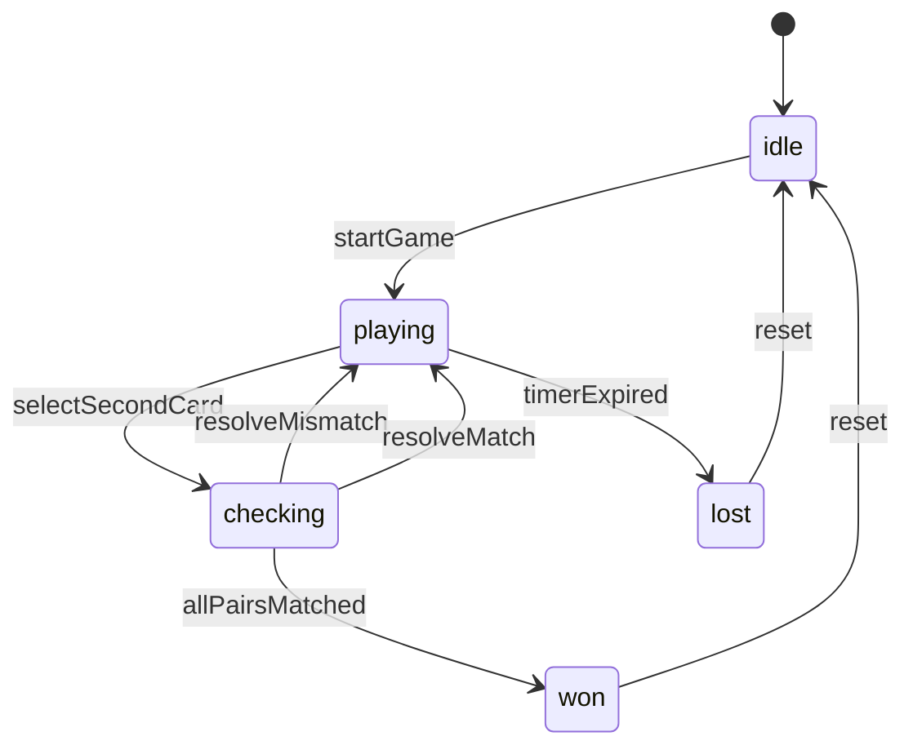

# State Machine

```mermaid
stateDiagram-v2
  [*] --> idle
  idle --> playing: startGame
  playing --> checking: selectSecondCard
  checking --> playing: resolveMismatch
  checking --> playing: resolveMatch
  checking --> won: allPairsMatched
  playing --> lost: timerExpired
  won --> idle: reset
  lost --> idle: reset
```
